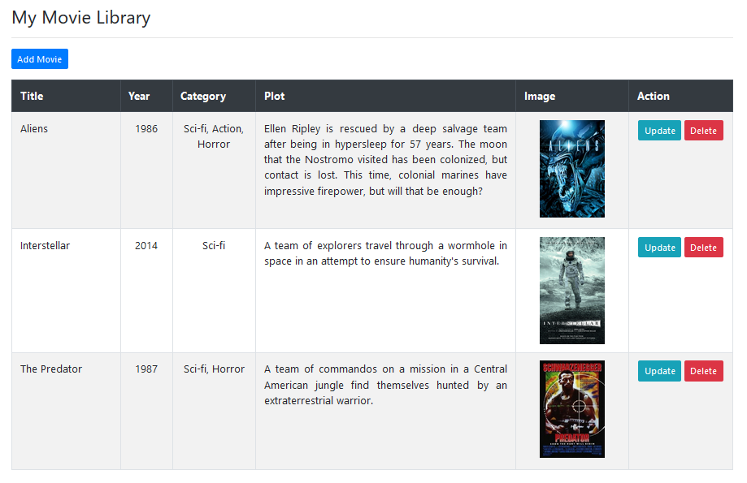
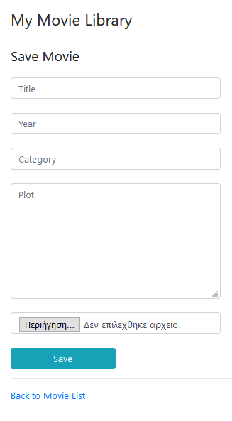
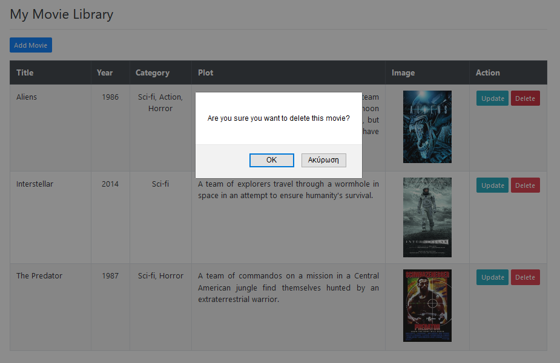
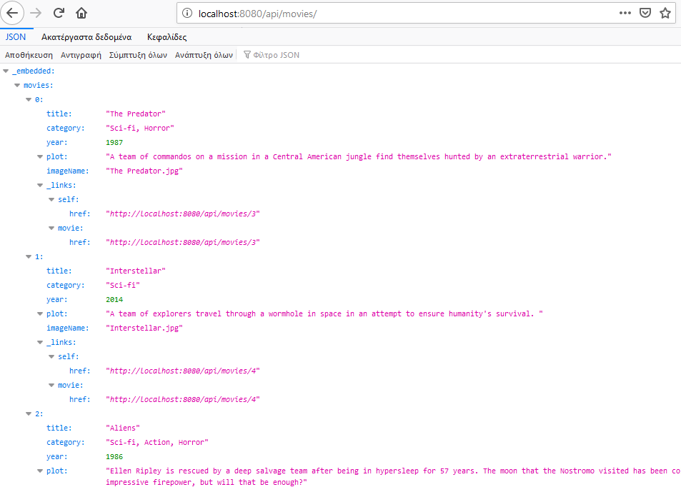

# Movie Library
<b>Description:</b>

An application that is connected to a database that contains a movie list and is able to perform
CRUD operations. The user has the ability to create a movie collection, providing a description and
upload an image for each movie.
  
<b>Technologies used:</b>
 
<ol>
	<li>Spring Boot</li>
	<li>Spring MVC</li>
	<li>Spring REST</li>
	<li>Spring Data JPA</li>
	<li>Apache Maven</li>
	<li>Thymeleaf</li>
	<li>MySQL database</li>
</ol>

# 

  

	<kbd></kbd>
	  
	<b>Image 1 - List Movies</b>

  
  

	<kbd></kbd>
	  
	<b>Image 2 - Add Movie</b>

  
  

	<kbd></kbd>
	  
	<b>Image 3 - Delete Movie</b>

  
  

	<kbd></kbd>
	  
	<b>Image 4 - REST API</b>

  
  